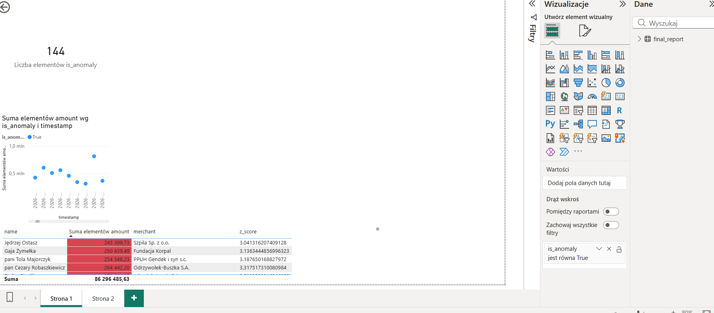

# 🏦 AML Transaction Monitoring System

## 📌 O projekcie
System typu End-to-End służący do wykrywania anomalii finansowych (prania pieniędzy) w danych bankowych. Projekt łączy inżynierię danych w Pythonie z analityką biznesową w Power BI.

## 🛠️ Stack Techniczny
* **Python**: Generowanie danych (Faker) i analiza statystyczna (Pandas, Numpy).
* **SQL (SQLite)**: Przechowywanie i czyszczenie danych transakcyjnych.
* **Power BI**: Interaktywny dashboard z systemem alertowym.

## 🧬 Metodologia: Model Z-Score
Do wykrywania anomalii wykorzystałem statystyczną metodę odchylenia standardowego. Transakcja jest flagowana, jeśli jej kwota znacznie odbiega od średniej klienta:

$$Z = \frac{x - \mu}{\sigma}$$

Gdzie:
* $x$ - kwota transakcji,
* $\mu$ - średnia wartość transakcji,
* $\sigma$ - odchylenie standardowe.

Każda transakcja z $Z > 3$ jest oznaczana jako **High Risk**.

## 📊 Podgląd Dashboardu

## 📂 Struktura Projektu
* `/src` - Skrypty Python (generowanie i czyszczenie danych).
* `/data` - Pliki źródłowe CSV oraz baza danych SQLite.
* `/reports` - Raport Power BI (.pbix) oraz dokumentacja wizualna.
